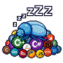
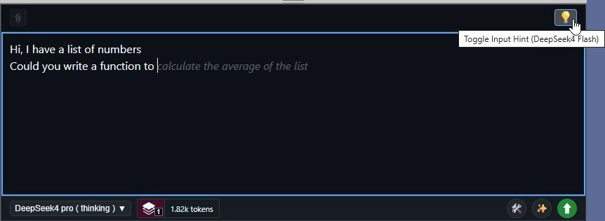
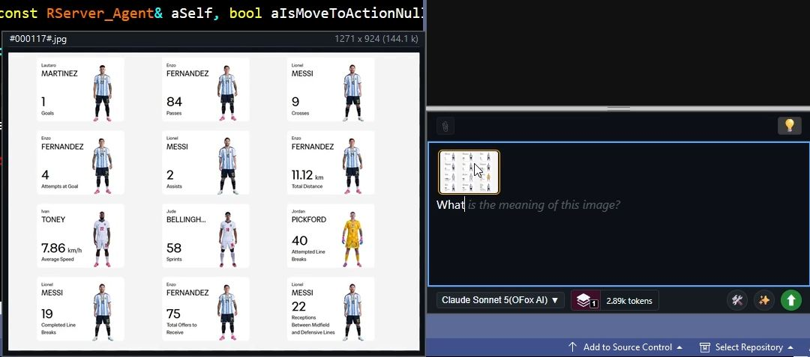
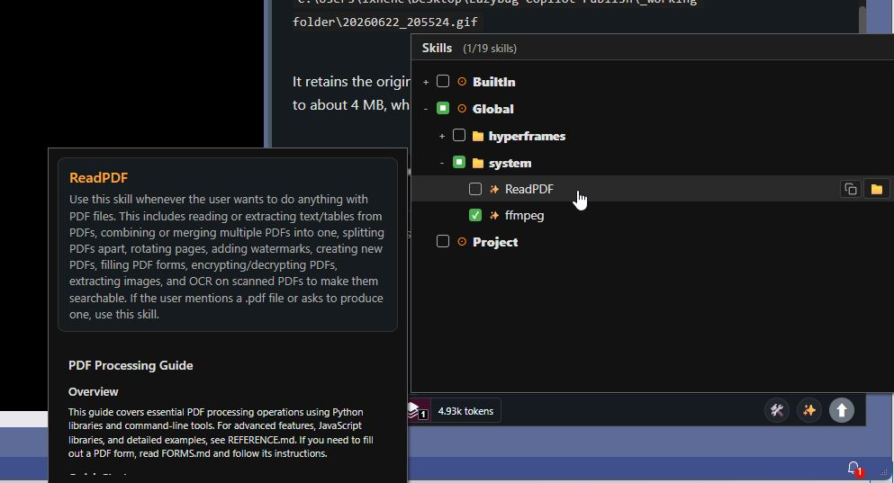
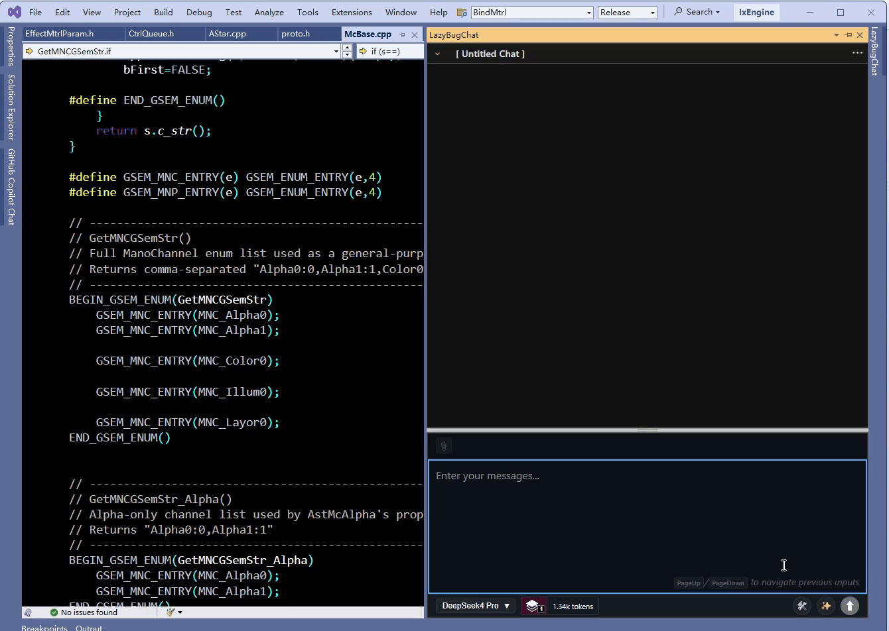



# LazyBug Copilot - Visual Studio AI Coding Assistant Extension

[Quick Start](doc/quickstart.md) | [Build Guide](doc/buildnotes.md) | [Patch Notes](doc/patchnotes.md) | [Usage Tips](doc/usagetips.md) | [Report an Issue](https://github.com/ixnehc/LazyBug-Copilot/issues)

> 📖 [中文版](doc/ReadMe_cn.md)

## Product Overview

LazyBug Copilot is a "Cursor-like" intelligent coding assistant extension designed specifically for Visual Studio. It integrates Large Language Model (LLM) capabilities to provide developers with intelligent code creation, refactoring, and Q&A experiences. The extension supports multiple mainstream AI service providers, enabling developers to enjoy AI-assisted programming within their familiar IDE environment.

▶️ [Watch the Introduction Video](https://www.youtube.com/watch?v=5fkBt-1-Q6g)

---

## Version 0.22 Release Notes

- Support background context compression, no more wait when starting a chat
- Add a new AddMcpServer tool to allow LLM to set up MCP servers dynamically
- Clicking symbol link now shows the symbol centered in the editor

_See [patchnotes.md](doc/patchnotes.md) for full version history._

---

## Core Features

- **Multi-Turn Intelligent Chat** — Markdown-based chat content. Session history stored per VS solution.
- **Session Management** — Switch between historical sessions, one-click rollback to any previous state, session favorites management, and cost statistics per session.
- **Symbol Link Recognition** — Clickable symbol links in the chat window for quick navigation to definitions.
- **Smart Code Editing** — AI directly modifies project files with multi-file support, before/after Diff View, modification tracking, undo/redo , and file backup.
- **Automatic Code Database** — Automatically builds a code database from all files in your solution with incremental updates.
- **Codebase Search** — Fast text search for ultra-large projects (million-line scale). Significantly faster than ripgrep, especially in large codebases. 
- **Symbol Search** — Fast symbol search for C/C++/C#/JavaScript/Java/Python/TypeScript codes. Works out of the box — no LSP configuration required.
- **Smart Input Box** — Tag-based file attachment system with `@` auto-completion, input history (`PageUp`/`PageDown`), quick model switching, and input hint completions while typing.

- **Image Attachment** — Paste images directly into the chat input to send to vision-capable LLMs.

- **Multi-Model Support** — Customizable API endpoints. Supports mainstream LLMs: OpenAI, Anthropic, Google Gemini, OpenRouter, Moonshot (Kimi), z.ai (GLM), DeepSeek and more. Also supports local LLMs (Ollama, LM Studio).
- **Multi-API Format** — Supports three API formats: OpenAI-compatible, Anthropic, and Gemini.

- **Skill System** — Browse, create, rename, and toggle skills via a management panel. Supports BuiltIn, Global, and Project-level skills. Allow using AI to edit or create new skills.

- **Custom Prompts** — `global_rules.txt` and `project_rules.txt` for customized prompts; 

- **CLI Tool Integration** — Execute cmd.exe, bash.exe, python.exe scripts directly from the chat, extending capabilities beyond coding.

- **Context Usage Control** — Real-time context usage display with 5 context levels. Allow keeping context under relatively low level (< 30k tokens) even in extremely long conversations while maintaining high response quality. Automatic compression/decompression when context level changes.

- **MCP Support** — Model Context Protocol server support via stdio and URL, with a built-in UI to manage them.

## Usage Scenarios

- **Code Review and Refactoring**: Let AI analyze your code and suggest refactoring improvements.
- **New Feature Development**: Describe your requirements, and AI will assist in generating code frameworks and implementations.
- **Bug Fixing**: Describe the issue symptoms, and AI will help locate and fix the bug.
- **Code Explanation**: Ask about complex code logic, and AI will provide detailed explanations.

