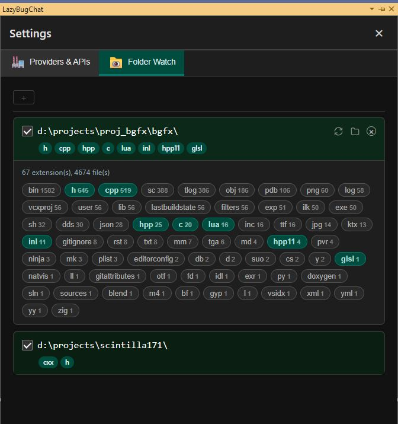
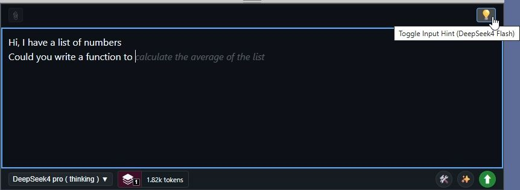
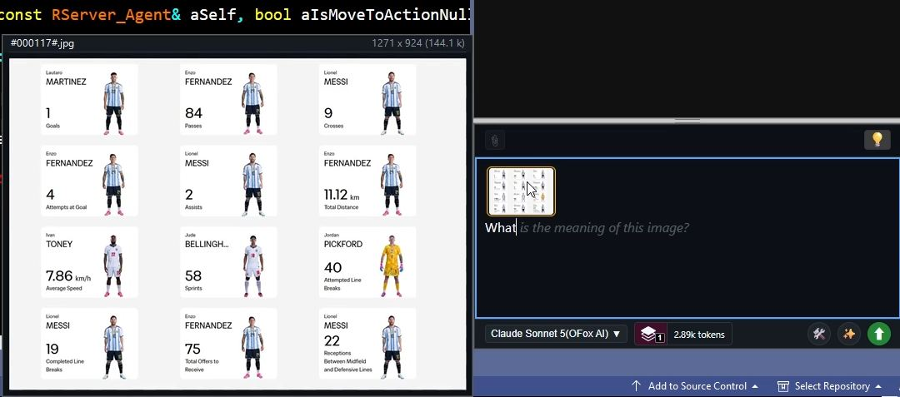
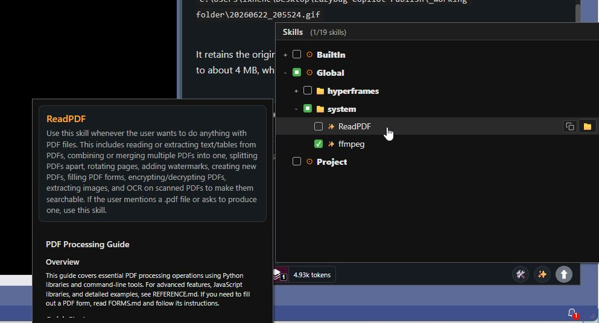
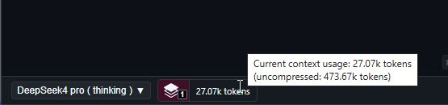
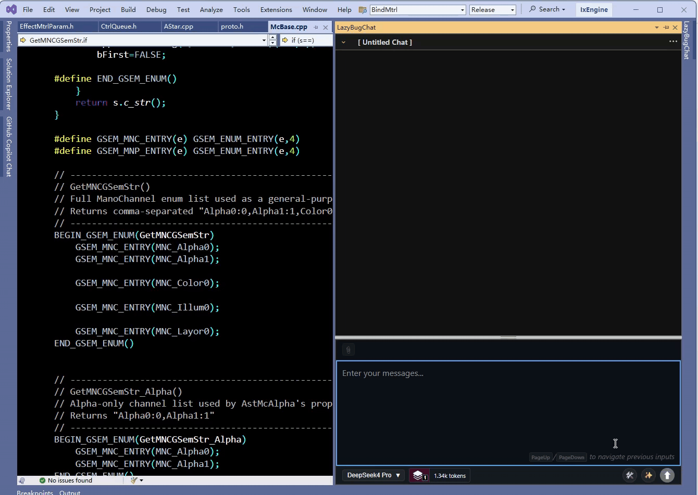

# LazyBug Copilot - Visual Studio AI 编程助手扩展

[快速开始](quickstart_cn.md) | [构建指南](buildnotes.md) | [更新日志](patchnotes.md) | [使用技巧](usagetips_cn.md) | [报告问题](https://github.com/ixnehc/LazyBug-Copilot/issues)

> 📖 [English](../ReadMe.md)

## 产品概述

LazyBug Copilot 是一款专为 Visual Studio 打造的"类 Cursor"智能编程助手扩展。它集成了大语言模型（LLM）能力，为开发者提供智能代码创建、重构和问答体验。该扩展支持多种主流 AI 服务提供商，让开发者能够在熟悉的 IDE 环境中享受 AI 辅助编程。

▶️ [观看介绍视频](https://www.youtube.com/watch?v=5fkBt-1-Q6g)

---

## Version 0.25.2 更新说明

- 修复了 Responses API 的 cache rate 计算错误

## Version 0.25.1 更新说明

- 新增图片格式支持 DDS、TGA、TIFF
- 修复了 input hint 有时会失效的问题
- 提高了对 MCP 服务器设置的兼容性

## Version 0.25 更新说明

- 不再支持 `cli_whitelist.txt`，改为根据 CLI 命令的风险等级提示用户确认
- 在文本编辑器内复制的多行文本将以引用方式粘贴到聊天输入框
- 聊天内容窗口内按右键快速滚动到上一条/下一条对话内容

_完整版本历史请参见 [patchnotes.md](patchnotes.md)_

---

## 核心功能

- **多轮智能对话** — 基于 Markdown 的聊天内容。会话历史按 VS 解决方案独立存储。
- **会话管理** — 切换历史会话、会话收藏管理、每次会话的费用统计。
- **符号链接识别** — 聊天窗口中可点击的符号链接，快速导航到定义处。
- **智能代码编辑** — AI 直接修改项目文件，支持多文件编辑、前后对比（Diff View）、修改追踪、一键撤销/重做以及文件备份。
- **自动代码数据库** — 自动从解决方案中的所有文件构建代码数据库，并自动监控文件变化并增量更新。
- **代码库搜索** — 对超大型项目（百万行规模）进行快速文本搜索。速度远超 ripgrep。在大型项目中可将搜索时间从数十秒缩短到小于 100ms。
- **符号搜索** — 快速符号搜索，支持 C/C++/C#/JavaScript/Java/Python/TypeScript。开箱即用，无需 LSP 配置。

- **监视文件夹** — 将任意文件夹添加到工作区，使用 glob、grep 和 find symbol 操作进行探索。非常适合引用外部代码/数据而无需将其加入解决方案。

- **智能输入框** — 基于标签的文件附件系统、`@` 自动补全、输入历史遍历（`PageUp`/`PageDown`）、快速切换模型，以及输入提示补全功能。

- **图片附件** — 直接将图片粘贴到聊天输入框中，发送给支持视觉的 LLM。支持 jpg、png、webp、gif、dds、tga、tiff 等文件格式。

- **多模型支持** — 可自定义 API 端点。支持主流 LLM：OpenAI、Anthropic、Google Gemini、OpenRouter、Moonshot（Kimi）、z.ai（GLM）、DeepSeek 等。同时支持本地 LLM（Ollama、LM Studio）。
- **多 API 格式** — 支持的 API 格式：OpenAI 兼容格式、OpenAI Responses、Anthropic 和 Gemini。

- **技能系统** — 通过管理面板浏览、创建、重命名和开关技能。支持内置、全局和项目级技能。允许使用 AI 编辑或创建新技能。

- **自定义提示词** — `global_rules.txt` 和 `project_rules.txt` 用于编写自定义提示词。

- **CLI 工具集成** — 直接在聊天中执行 cmd.exe、bash.exe、python脚本，扩展编程之外的能力。

- **上下文使用控制** — 实时显示上下文使用量，提供 5 个上下文级别。即使在极长对话中也能将上下文保持在较低水平（< 30k tokens），同时保持较高的回答质量。上下文级别变化时自动压缩/解压。

- **MCP 支持** — 通过 stdio 和 URL 支持 Model Context Protocol 服务器，内置管理界面。

## 使用场景

- **代码审查与重构**：让 AI 分析你的代码并提出重构改进建议。
- **新功能开发**：描述你的需求，AI 将协助生成代码框架和实现。
- **Bug 修复**：描述问题症状，AI 将帮助定位并修复 Bug。
- **代码解释**：询问复杂代码逻辑，AI 将提供详细解释。
