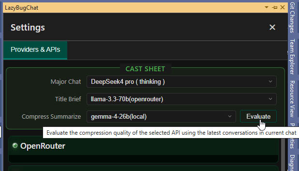

# Usage Tips

- **Open the Chat Panel**: Open the chat panel via the Visual Studio menu `View` → `Other Windows` → `LazyBug Chat`. It is recommended to bind a shortcut to the `View.LazyBugChat` command for quick access.
- **Database and Disk Space**: The LazyBug chat database is independent of the project and is stored centrally on the C drive. Please ensure sufficient free space on your C drive (for ultra-large projects, more than 10 GB may be required).
- **Adding File Attachments**:
  - Select a file in the **Solution Explorer**, right-click, and choose **Add to LazyBug Chat** to attach it to the current conversation.
  - You can also do the same by right-clicking the file's tab above the code editor.
- **Symbol Database Construction (C/C++)**: When you open a C/C++ project for the first time, LazyBug will automatically build the symbol database in the background. For ultra-large projects (e.g., 3 million lines of code), this process may take a significant amount of time (approximately 30 minutes to 1 hour). Symbol query results may not be fully accurate until the build is complete.
- **Code Comparison (Diff View)**:
  - Click the title of a file editing label in the chat panel to display the Diff view in the main editor; press `Space` to hide it.
  - Clicking the title repeatedly allows you to quickly jump between different diff hunks.
- **Avoid Editing Conflicts**: Please do not manually edit files while AI is working, especially when it is modifying file contents.
- **Input Hint Model Selection**: The input hint feature requires a model with fast response time, good context understanding, and strong instruction-following capability — while also being affordable. We recommend **DeepSeek 4 Flash** as the go-to model for input hints, as it strikes the best balance between speed and quality for real-time completions.
- **UI Scaling**: When the mouse focus is inside the LazyBug chat window, hold `Ctrl` and scroll the mouse wheel to freely zoom the interface and text size.
- **Cost Statistics**: The cost for each chat turn is calculated based on the unit price entered in the LLM api setting. When the LLM provider uses a complex billing model (such as a subscription plan), the statistics are approximate and for reference only.
- **Task Breakdown Strategy**: LazyBug is not designed to handle extremely large and complex tasks in a single pass. Break your development tasks into smaller, clearly defined sub-tasks for the best AI-assisted experience.
- **Code Database Updating**: After adding a new file to the solution, save the solution file so that the new file is included in the code database.
- **Skill Usage**:
  - There are 3 types of skills:
    - **BuiltIn**: Verified skills bundled with the extension. These should generally not be modified.
    - **Global**: Skills shared across all projects.
    - **Project**: Skills specific to the currently opened project.
  - Activating a skill does not mean its full content is loaded into the context. To force-load a skill, copy its path and paste it into the file attachment list.
  - Many existing skills exist in the ecosystem and may have compatibility issues with LazyBug. You may need to tweak them until they work smoothly.
  - You are always encouraged to use AI to edit existing skills or create new ones.
  - Install the necessary environments (Node.js, Python, GIT, etc.) to support various CLI commands.
- **Compression Model Selection**: Use the **Evaluate** button to assess the speed, reliability, and compression quality of the currently selected compression model, helping you choose the most suitable one.

- **How Context Level Works**:
  - When context usage reaches a level's upper limit (threshold), LazyBug compresses the context down to the target lower limit. This keeps conversations sustainable without unbounded token growth.

    | Level   | Threshold (upper) | Target (lower) |
    |---------|-------------------|----------------|
    | Level 1 | 30k tokens        | 10k tokens     |
    | Level 2 | 50k tokens        | 30k tokens     |
    | Level 3 | 100k tokens       | 50k tokens     |
    | Level 4 | 200k tokens       | 100k tokens    |
    | Level 5 | 500k tokens       | 200k tokens    |

- **Context Level Settings Consideration**:
  - Higher context levels consume more tokens and incur higher costs, especially on expensive models.
  - However, higher context levels reduce the frequency of compression, which improves cache hit rates and can also lower costs to some extent.
  - Currently, context is not compressed within a single Q&A turn to avoid cache miss.
  - Compression is not unlimited — it will always preserve a baseline answer quality. So even if you set a low context level, sometimes context usage may still significantly exceed the upper limit.
  - That said, compression will more or less degrade the model's answer quality.
  - **Overall recommendation**: For expensive models (Anthropic, GPT), set the lowest context level (Level 1, < 30k tokens), unless you notice a significant drop in answer quality.